# CADing a Case for Arknights Authorisation Passes

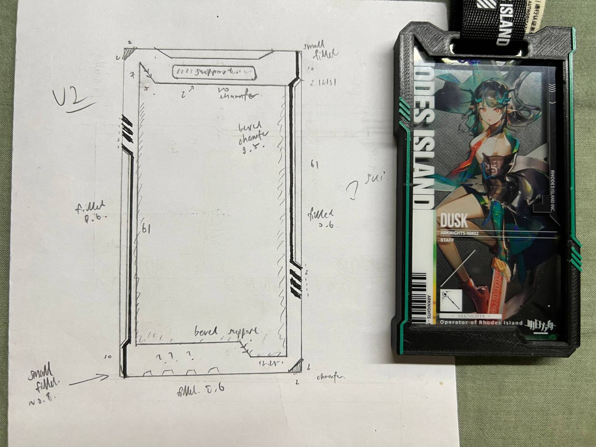 

## Preface

I bought a pair of acrylic Arknights authorisation passes. I want to protect them. 

I have always been printing out readily-made 3D models (guilty admission) with my FDM 3D Printer (ELEGOO Neptune 3 Pro), and this is the third time I have ever touched a CADing tool (with the first being in school & second being making a Chinese-styled seal for my grandmother). 

Without further ado, let's get to CADing.

## The Process

I opted to use FreeCAD since Fusion360 (which I had previously used) is unavailable on Linux. 

### V1

First we start with a rectangle. 

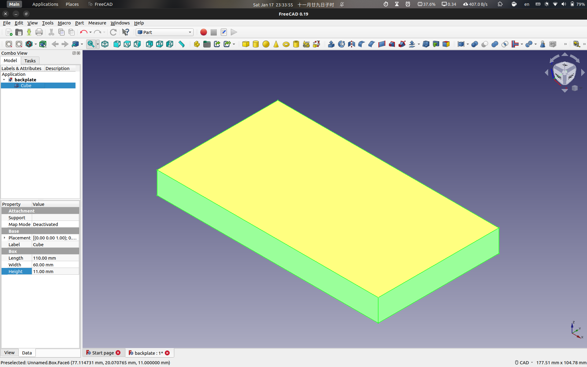 

Then we put a hole through the rectangle. Then another one. Note that we are doing this through `Sketch` then pocketing said sketch down on the `Part Design` Toolbench.

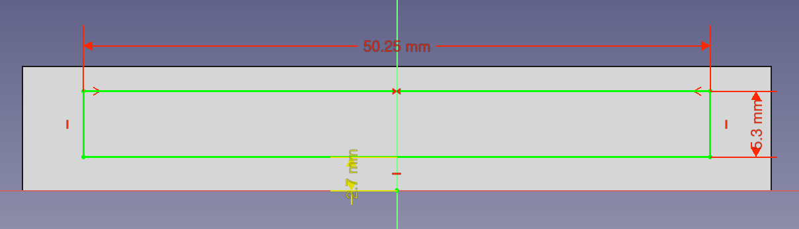 

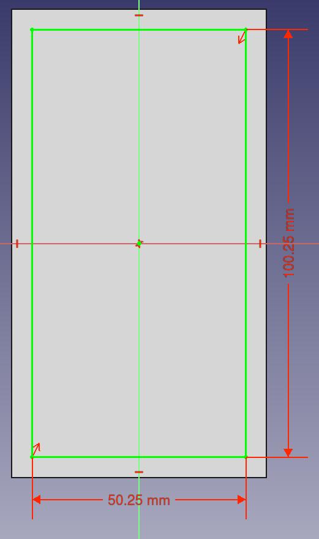 

Below shows the product after pocketing. I left 0.25mm of allowance for both of the dimensions to let the acrylic slide in snugly.

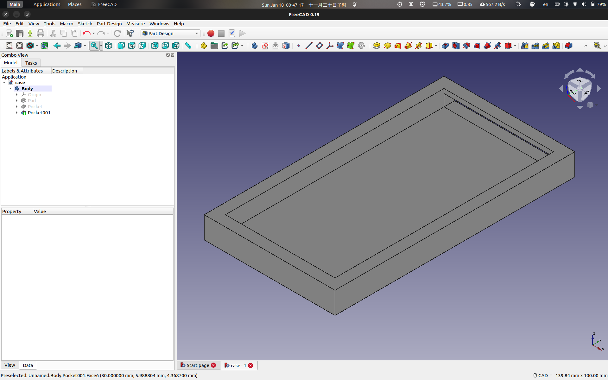 

HOWEVER. I realise that whatever I made above didn't give me room to make the top face's bevel (i.e. the funny border on the top side preventing the acrylic from falling out). Hence I resketched the top face and pocketed down from there.

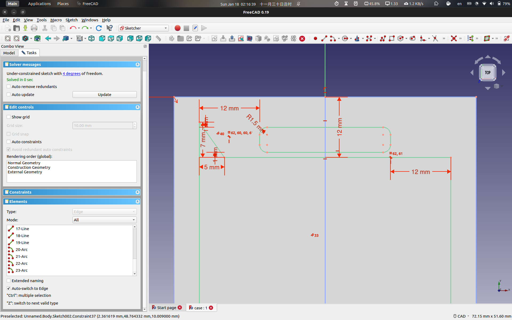 

Ta-da! Bevel hole has been pocketed down. All that's left is to give it a few fillets here and there and chamfer the bottom part (in contact with printing bed) because I heard that is what you do.

#### Final V1

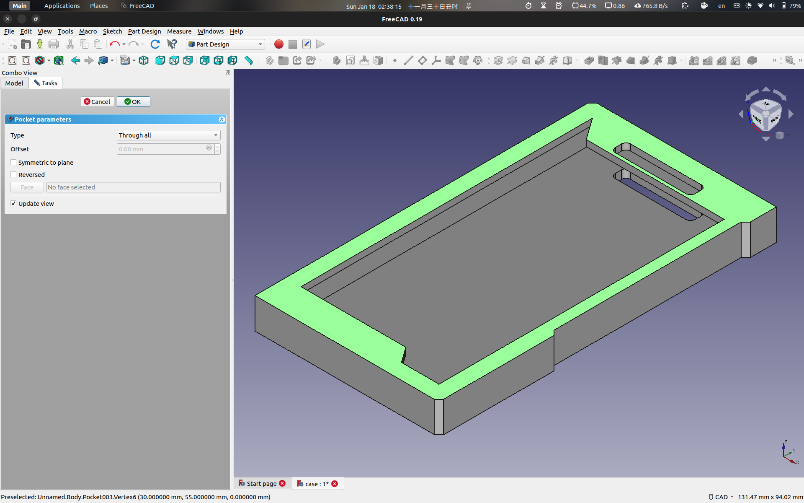 

I sliced the model at 20% grid infill + normal supports and went to take a bath. 

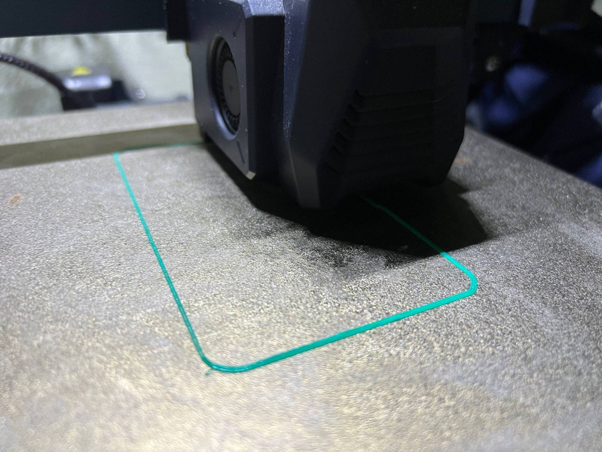 

By the time it finished printing, the time was already 0400h in the morning. We had arrived at the V1 product, and it fit too well. First ever self-CAD product! Please clap for me. I cut out the supports, put the acrylic in and went to sleep.

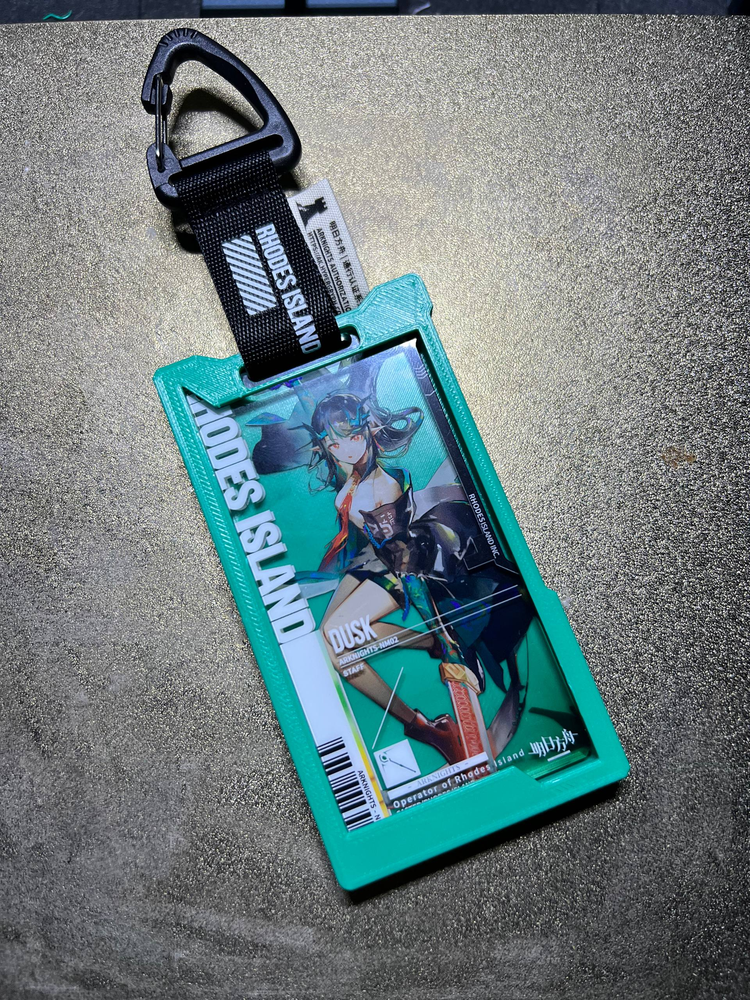 

### V2

It is now the next day. I have been contemplating additional changes:

1. There is one piece of bridging material that is **way** too weak — the width at that point is only 0.50mm. I ought to strengthen it.

2. Additional bottom-face design? I wanted to add the Sui logo from Arknights.

3. Fancier top-face design! I realised there was no need to restrict the imagination to the bevel itself, as I had the power of AMS printing. (In reality I did not have automatic colour switching. Rather, I programmed in the slicer to `swap at layer`, letting me replace the filament for another colour at one of the layers. See [here](https://red-dot-geek.com/multicolor-3d-prints-single-extruder/).) Hence, **I decided to add some lines** to fit the Arknights vibes.

#### Improvement 1: Bridging

I tried to resketch the bevel face but making the top thicker would cover a lot of the art's details on the acrylic. I figured that since this was not the loadbearing connector, surely it would fare decently alright when left alone. 

Verdict: **No change to that bridge.**

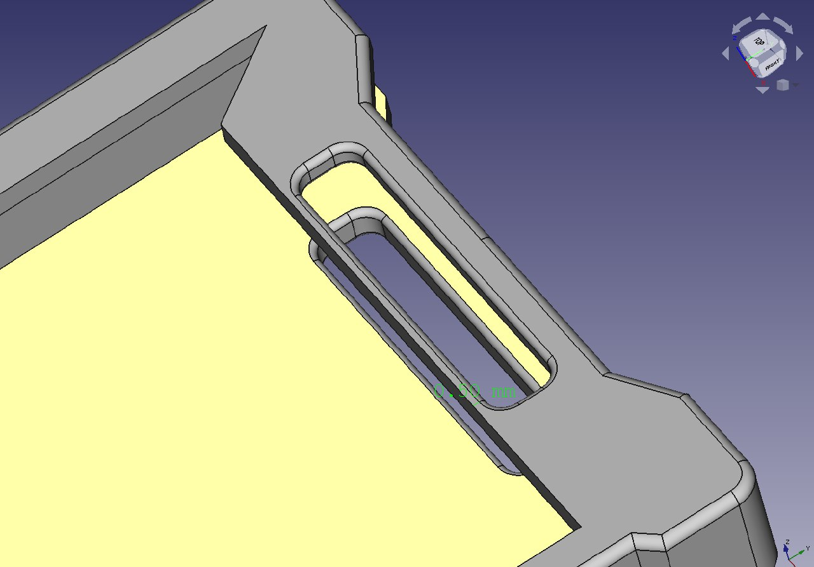 

#### Improvement 2: Bottom-face Art

This is the most regrettable part. I tried for a few hours to get a vector svg (sanitised via Inkscape) into FreeCAD but there was always something wrong. Same went with embossing words on top of the bevel face. In the end, I stuck to just **normal designs and nothing on the bottom face**. Below are a few images of my FreeCAD imploding, literally. 

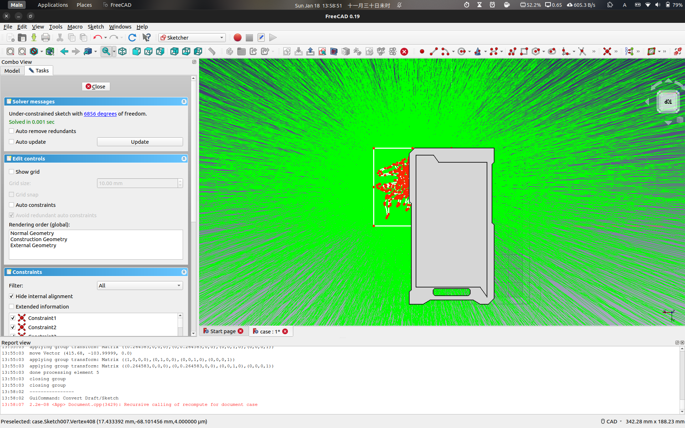 

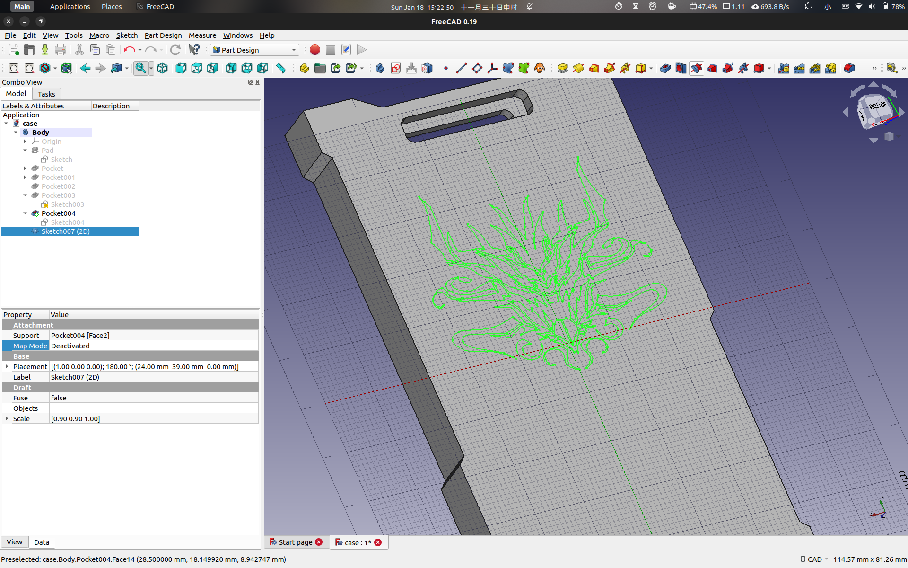 

^ I could not stick the vector graphic on......

#### Improvement 3: Lines

Haha funny lines go brr. These sketches may look like a lot but in reality they are just mechanical copy-and-paste's. It still took me two hours though as I was getting CADer's block (?) at the design stage. 

In the end, I went for a bunch of wire-like lines. 

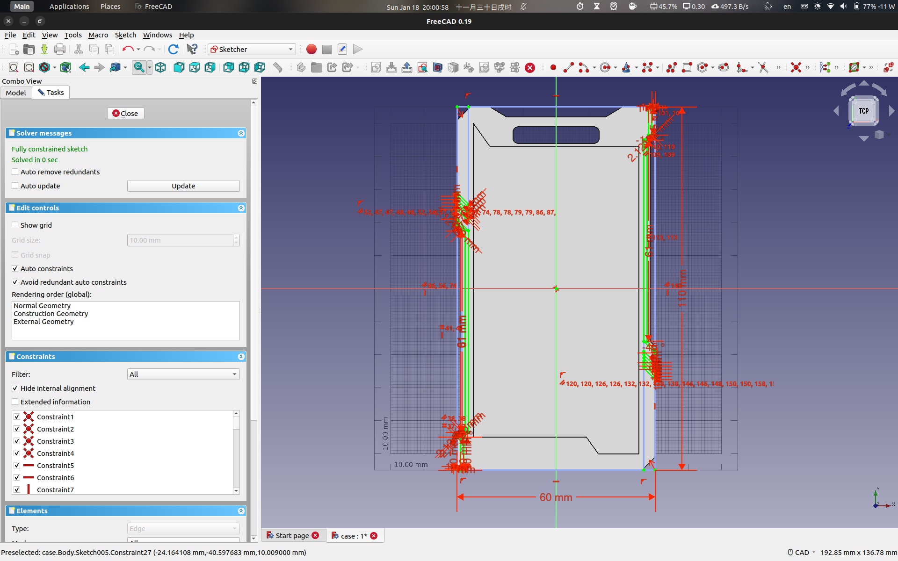 

#### Final V2

My turquoise filament was also running out, so I used black filament instead. Turquoise filament would make up the top-face wire design.

Notably, I also chamfered away some of the top side of the case, to allow for easier attachment of the velcro strip. I chamfered the top left and bottom right sides for a more industrial look, and went for 0.6mm & 1.2mm fillet on all surfaces on top of that. 

Behold, V2's final design.

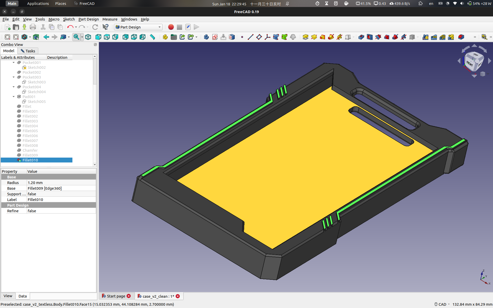 

The printer's sound is music to my ears.

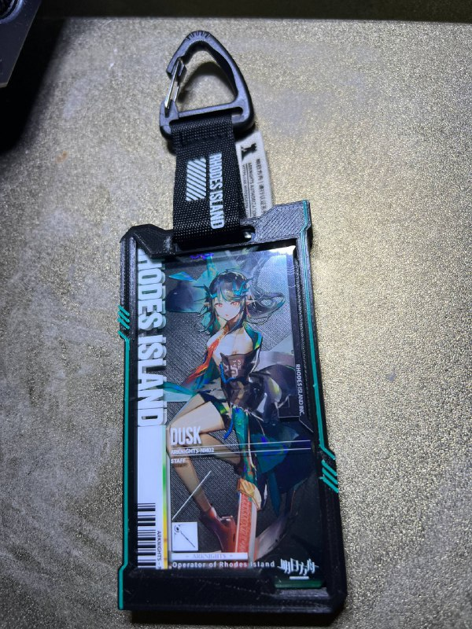

## Final Products

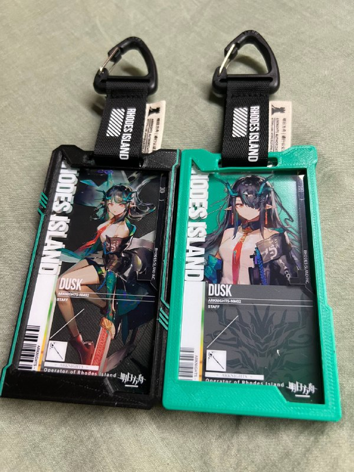

## Limitations & Improvements

- The 0.50mm weak point on the top of the bevel is still easily bent. 
- I did not possess any clear film to slot into the front to prevent dust from gathering on the surface of the acrylic.
- No cool patterns on the back :(
- My measurements were very very snug. This means the acrylic might get stuck inside. Pulling the acrylic out for the first time takes immense strength and it could damage said acrylic piece.
- I could add simple lights into the case like how some others do. Maybe even leave a card slot for slotting my transport card. The possibilities are endless.

## Final Words

I would say this was largely a successful first step into CADing. Next time I will figure out the embossing & graphics. Surely I will. Thanks for reading.

P.S. The V2 case containing Elite 2 Dusk is now permanently on my bag.

## Files

- [Case V1](../../public/blog/posts/arknights-CAD/case_v1.stl)

- [Case V2 (Clean)](../../public/blog/posts/arknights-CAD/case_v2_clean.stl)

