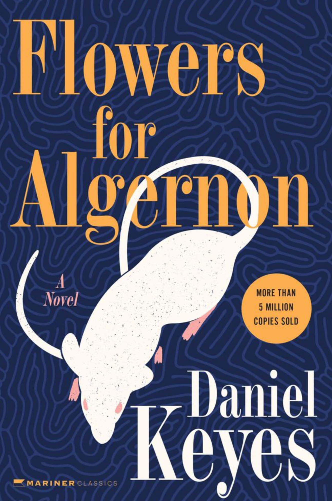

# Flowers for Algernon - Daniel Kayes

8.5/10

start date: 9 november 2024

finish date: 12 november 2024

(this is my review for the long version. read the original version as well but i read the long one first and it sticks better)

in the novel the protagonist charlie gordon is mentally challenged and gets smart after an operation and returns to his original state if not worse. this is a shorter one than the previous book i read (garden of evening mists by tan twan eng) but that does not make it any less profound. i rate it 8.5 because this book brings me uncomfortably close to the inner workings of a person who has gone through intense emotional turmoil. a previously mentally challenged one at that.. and it is a horrifying journey to see him experience each stage in his intellectual development (and undevelopment) and have him be helpless about it throughout. the entire story parallels charlie with the mouse algernon and this helplessness also matches algernon. lab rat lab rat lab rat

he immensely resents the fact that others did not treat him as human before the operation. nemur and strauss especially. i think he would not have become this spiteful and would not have lost his faith in the goodness of mankind (has he?) if those around him treated him with dignity and as an actual human.

but such a circumstance reflects reality. the things the people do are things that sound like they would be spoken in real life. from the teasings to the beatings to the struggles and the ostracising. i feel one with mental disabilities in this day and age would definitely still be subjected to these woes even with progression of society and increased support for them. this is why i am so deeply touched by this narrative. 

flowers for algernon also touches on the ethics of artificially increasing intelligence. the story discusses a potential scenario where the decline in intelligence is directly proportional to the magnitude of intelligence gained artificially and it is a heartwrenching tale of a struggle to climb up becoming a struggle to latch on. charlie and algernon scaled a ladder towards "salvation" with the external help of the operation, and when the ladder eventually collapses in on itself poor charlie and algernon are drawn to the ground. like iron filings to magnets. icarus with his beeswax wings. 

the novel mentions the first doctor charlie goes to see. he says other kids wanted to undergo the treatment he had (some electrical machine? that you needed to pay 10 dollars every treatment session) because they wanted to increase their intelligence and become geniuses. now it makes me think - if the experiment on algernon and charlie had not failed in any way and allowed them to keep this almost inhuman intellect, how long would it take other people of "normal" IQ to pay five arms and legs to have the procedure done on them? was the world really shaken and celebrating strauss and nemurs discovery for the fact that the "retardates" are now able to live a normal-er life? or were they celebrating the one scientific breakthrough that can potentially mean commercialised operations for aritifical increase in intelligence?

come to think of it the artificial engineering and increase of intelligence for all mankind doesnt sound like that bad of an idea. but in this story and in real life the world is never perfect and there is no such thing like free lunch or intellect boost without consequences (yet?).. but it doesnt make everyone less able and neither does it make those with mental disabilities any less able to experience the human world and to truly love. the story shows a peek into the warren home and there are bigger "retardates" caring for small ones and it is such a heartwarming sight although the home was depicted to have a bleak outlook. i hope these guys found solace in each other at least..

i wish to comment something else about love and charlie trying to convince himself that he can work emotionally with fay but failing and seeking ms alice kinnian but i think i will not. it is very profound though

overall i was thoroughly hooked into this emotional roller coaster and stayed up for three nights binging this book.  thank you 白 from moriya shrine (qq) for the recommendation. i wish the best for humanity and everyone like charlie. solid 8.5/10

i will now put down the parts that i enjoyed the most or found profound whilst reading

---

> And the other ten times we did it over Algernon won evry time because I coudnt find the right rows to get to where it says Finish. I dint feel bad because I watched Algernon and I lernd how to finish the amaze even if it takes me along time.
I dint know mice were so smart.

---

> Then prof Nemur said remembir he will be the first human beeing ever to have his intelijence increesd by sergery. Dr Strauss said thats exakly what I ment. Where will we find another retarted adult with this tremendus motor-vation to lern. Look how well he has lerned to reed and rite for his low mentel age. A tremen** achev**

---

oh god theyre giving him a lobotomy

---

> I askd Prof Nemur if I coud beet Algernon in the race after the operashun and he sayd mabye. If the operashun werks good Ill show that mouse I can be as smart as he is even smarter. Then Ill be abel to reed better and spell the werds good and know lots of things and be like other pepul. Boy that woud serprise everyone. If the operashun werks and I get smart mabye Ill be abel to find my mom and dad and sister and show them. Boy woud they be serprised to see me smart just like them and my sister.

> Prof Nemur says if it werks good and its perminent they will make other pepul like me smart also. Mabye pepul all over the werld. And he said that meens Im doing somthing grate for sience and Ill be famus and my name will go down in the books. I dont care so much about beeing famus. I just want to be smart like other pepul so I can have lots of frends who like me.
this entire first part is foreshadowing. god bless charlie

---

> She's very skinney and when she talks her face gets all red. She says mabey I better prey to god to ask him to forgiv what they done to me. I dint eat no appels or do nothing sinful. And now Im skared. Mabey I shoudnt of let them oparate on my branes like she said if its agenst god. I dont want to make god angrey.

nurse comes to talk about god

---

> I still think those races and those tests are stoopid and I think riting these progress reports are stoopid to.

impatience

---

> I could see he wanted to end the discussion at that point, but somehow I couldn't let go. I had to find out just how much he knew.

> I found out.

> Physics: nothing beyond the quantum theory of fields. Geology: nothing about geomorphology or stratigraphy or even petrology. Nothing about the micro- or macroeconomic theory. Little in mathematics beyond the elementary level of calculus of variations, and nothing at all about Banach algebra or Riemannian manifolds. It was the first inkling of the revelations that were in store for me this weekend.

he is getting complacent

---

> Who and what am I now? Am I the sum of my life or only of the past months?

---

> 5:30 P.M.—That crazy Fay came in through the fire escape this afternoon with a female white mouse—about half Algernons size—to keep him company, she said, on these lonely summer nights. She quickly overcame all my objections and convinced me that it would do Algernon good to have companionship. After I assured myself that little "Minnie" was of sound health and good moral character, I agreed. I was curious to see what he would do when confronted with a female. But once we had put Minnie into Algernon's cage, Fay grabbed my arm and pulled me out of the room.

> "Where's your sense of romance?" she insisted. She turned on the radio, and advanced toward me menacingly. "I'm going to teach you the latest steps."

> How can you get annoyed at a girl like Fay?

> At any rate, I'm glad that Algernon is no longer alone.

he is also no longer alone. parallels algernon against himself again

---

> "Charlie, don't run away again."

> "I'm through running. I've got work to do. Tell them I'll be back to the lab in a few days—as soon as I get control of myself."

> I left the apartment in a frenzy. Downstairs, in front of the building, I stood, not knowing which way to go. No matter which path I took I got a shock that meant another mistake. Every path was blocked. But, God... everything I did, everywhere I turned, doors were closed to me.

> There was no place to enter. No street, no room, no woman.

god bless him

---

> the meaning of my total existence involves knowing the possibilities of my future as well as my past, where I'm going as well as where I've been. Although we know the end of the maze holds death (and it is something I have not always known—not long ago the adolescent in me thought death could happen only to other people), I see now that the path I choose through that maze makes me what I am. I am not only a thing, but also a way of being—one of many ways—and knowing the paths I have followed and the ones left to take will help me understand what I am becoming.
charlie sees algernon becoming stupid all of a sudden and probably is worried. he seeks resolution i think

---

> This was the way we loved, until the night became a silent day. And as I lay there with her I could see how important physical love was, how necessary it was for us to be in each others arms, giving and taking. The universe was exploding, each particle away from the next, hurding us into dark and lonely space, eternally tearing us away from each other—child out of the womb, friend away from friend, moving from each other, each through his own pathway toward the goal-box of solitary death.

> But this was the counterweight, the act of binding and holding. As when men to keep from being swept overboard in the storm clutch at each other's hands to resist being torn apart, so our bodies fused a link in the human chain that kept us from being swept into nothing.

> And in the moment before I fell off into sleep, I remembered the way it had been between Fay and myself, and I smiled. No wonder that had been easy. It had been only physical. This with Alice was a mystery.

> I leaned over and kissed her eyes.

> Alice knows everything about me now, and accepts the fact that we can be together for only a short while. She has agreed to go away when I tell her to go. It's painful to think about that, but what we have, I suspect, is more than most people find in a lifetime.

---

> Why am I always looking at life through a window?

---

> Nov 16-—Alice came to the door again but I said go away I dont want to see you. She cryed and I cryed to but I woudnt let her in because I didnt want her to laff at me. I told her I didnt like her any more and I didnt want to be smart any more either. Thats not true but. I still love her and I still want to be smart but I had to say that so she woud go away. Mrs Mooney told me Alice brout some more money to look after me and for the rent. I dont want that. I got to get a job.

> Please... please... dont let me forget how to reed and rite...

---

> Later Gimpy came over limping on his bad foot and he said Charlie if anyone bothers you or trys to take advantage you call me or Joe or Frank and we will set him strait. We all want you to remember that you got frends here and dont you ever forget it. I said thanks Gimpy. That makes me feel good.

> Its good to have frends...

---

> If you ever reed this Miss Kinnian dont be sorry for me. Im glad I got a second chanse in life like you said to be smart because I lerned alot of things that I never even new were in this werld and Im grateful I saw it all even for a littel bit. And Im glad I found out all about my family and me. It was like I never had a family til I remembird about them and saw them and now I know I had a family and I was a person just like evryone.

---

> Goodby Miss Kinnian and dr Strauss and evrybody...

> P.S. please tel prof Nemur not to be such a grouch when pepul laff at him and he woud have more frends. Its easy to have frends if you let pepul laff at you. Im going to have lots of frends where I go.

> P.S. please if you get a chanse put some flowrs on Algernons grave in the bak yard.

---

☆———

---

© 2024 msa - CC BY-NC-SA 4.0

---