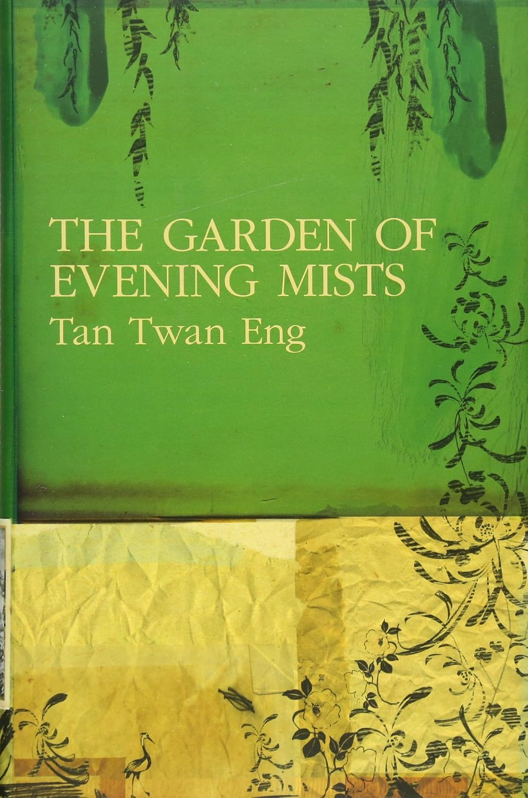

# The Garden of Evening Mists - Tan Twan Eng

8/10

start date: 10 october 2024

finish date: 9 november 2024

i dont usually read and i hope this book is the first among many that i will subsequently read and pen down my reviews of inside this library. 

maybe treating the book not as a literature set text examinable in a gcse A levels exam helped give more time and leisure for me to digest. to take breaks and consume the story in my own pace. thinking about the novel and its morals feels strange and complex and i honestly dont think i want to generalise the book in a way that disregards the many components that make it such an enchantingly sad story..
reading this book made me experience new emotions. emotions i have not had registered and understood.

till now i cannot put a word for it but i thoroughly enjoyed reading the book. as i follow the story of malayan japanese occupation victim teoh yun ling, seeing the wars and malayan emergency through her point of view, it made me appreciate the peace we have now. the wars in the bovel (boer war, wwii and the japanese occupation, malayan emergency, and even the opium wars) caused so much destruction on such large scale that every character in the story seemed to be affected by them in some way or another. yun ling lost her sister and her mother went insane. magnus lost his loved ones and his eye. unsure what arimoto lost but he definitely seemed uncertain of things. he needed fixing as well. maybe it is the guilt that he felt from carrying out operation golden lily then facing the direct victim of said war crime.

i like the parts where yun ling comes to terms with everything. first she becomes an apprentice to arimoto which is crazy and if it were me i am not sure if i will have the courage to go on as well. seems logical though. she then studies japanese gardening to its roots to keep to yun hongs words and i think that is very heartwarming. 

the book has still caused me to be unsure of whether i like arimoto as a character. he acts with such self inflicted (?) righteousness out of his upbringing and adopts the traditional ways of the japanese. but at the same time he carries out the orders of the japanese emperor regarding the vilest crimes. although it did not involve him directly murdering people he was still one of the masterminds behind countless things. it is difficult for me to gauge whether he is a "good" person or an "evil" person because he did this to fulfill his obligations and allegiance to the japanese royalty. he still treated yun ling with utmost respect and protected the workers at yugiri and around it from atrocities during the war. part of me hopes he was extremely remorseful after what he did and gave all this care to yun ling as he was guilty. part of me also secretly wishes he were a vicious evildoer so i can hate him as an antagonist and stop there. the change in his actions showed he developed as a person though.. i like that as well.

overall an 8/10 because i definitely enjoyed reading through it. took me a month and i keep thinking back to the story every now and then in my time off the book. good night yun ling

in my conversations with my friend fwyr:

"if you have any insights or find any striking quotes tell me"

"as you are doing right now"

"the travesty of literature is that we are each only one person"

so here are some parts i liked

> I never wondered about it, just as I never thought it strange that I should also have been born beneath the monsoon skies of the equator, that with my first breath I would inhale the humid, heated air of the tropics and feel immediately and forever at home.
malaya

---

> tiew neh ah mah chau hai!

sorry. i had to leave this in. 粤韵风华.

---

> It was a storm of meteors, arrows of light shot by archers from the far side of the universe, igniting and burning up as they pierced the atmospheric shield. Hundreds of them burned out halfway, flaring their brightest just before they died.
wow

---

> Fumio had warned her, ‘Kill yourself, and your sister will take your place.’
god bless yun hong she is so respectable

---

>  ‘He presented the water wheel to me, on behalf of the Emperor.’ Aritomo studied the creases on his palms. ‘If it can console you in some way, however small, I can assure you that Tominaga did not rape your sister. He preferred men. Always had. I think he went to see your sister because he thought you would not have left without her.’

i hope tominaga finds peace but still pays for his role to play in the war crimes

---

> ‘Once, when I was being disobedient, my mother told me a story about a murderer,’
Aritomo said, his voice dry as the scent of sandalwood perfuming the air. ‘He had been sent to Hell after he died. One day, as the Buddha was walking in a garden in Paradise, he happened to glance into a lotus pond. And deep in the pond he saw this murderer, suffering the agonies of Hell.

> ‘The Buddha was about to resume his walk when he saw a spider spinning its web, and he remembered how the murderer had once refrained from killing a spider crawling up his leg.

> With the spider’s permission, the Buddha took a strand from the web and dangled it into the lotus pond.

> ‘Down in the depths of Hell, the murderer saw something gleaming in the blood-red sky, dropping closer and closer to him. When it was just above his head, he reached out and pulled it.

> To his surprise, it bore his weight. He began to climb out of Hell, to climb up to Paradise. But the distance from Hell to Paradise is thousands and thousands of miles. The other sinners soon saw what he was doing, and they too began to climb up the web. He was higher now, almost out of Hell. Stopping for a rest, he looked down and saw the thousands of people, men and women, old and young, all trying to follow him, all clinging on to the thread. “Let it go! This thread is mine!” he screamed at them. “Let it go!”

> ‘But no one listened to him. He was terrified that the strand would break. A few of the others had almost caught up with him. He kicked at them, kicked them until they released their grip and dropped away. But his frantic movements broke the strand above him, and then he too plummeted back into Hell, screaming all the way.’

> Swallows flew between the rafters, stirring the incense smoke in their wake.

> ‘I couldn’t sleep for weeks after hearing that tale,’ Aritomo said.

this was at the temple 3/4 up the hill. wow

---

> ‘Aritomo’s work wasn’t done when he left.’

> The nun turns to me, and smiles: not at me, but at the world itself. ‘Ahhh... Can you be certain of that?’
ahhh... the work was done on yun ling. i think

---
 
> ‘Poor, poor Hou Yi, yearning for the wife he had lost to the moon,’ I say. ‘He should have made himself forget her.’

> ‘Perhaps he couldn’t,’ replies Frederik. ‘Perhaps he didn’t want to.’
frederik and his unrequited love with yun ling

god bless him

---

> Are all of us the same, I wonder, navigating our lives by interpreting the silences between words spoken, analysing the returning echoes of our memory in order to chart the terrain, in order to make sense of the world around us?

---

> I walk around to the back. I stop when I see the pair of statues, Mnemosyne and her nameless twin sister. The Goddess of Memory has remained unchanged but, to my dismay, her sister’s face is almost worn smooth, her features rubbed away. Perhaps it is caused by the difference in the quality of the stone the sculptor used, but it unsettles me nonetheless.

🙏🙏🙏 

is forgotten

---

> The trees rustle in the wind. The arrows in the quiver-stand behind me shake softly, and I hear the shifting pebbles in the bed in front of the shajo; it sounds like someone cracking their knuckles. In my blindness I fit the arrow against the bowstring and pull it, feeling my ribs expand. I see the target in my mind as I wait for the wind to drop. A feeling of tranquillity takes hold of me and I know I can stand there in that void forever.

> I release the arrow, my mind guiding it all the way to the heart of the matto in one extended exhalation. From the song of the bowstring vibrating back into silence, strong and pure, I know it is the best shot I have ever made.

> For a long time I stand there. I stand there until the emptiness in my eyes fills with shapeless objects again, coalescing into the familiar forms of trees and mountains and the long gravel bed in front. Lifting a hand to my eyes, I become visible to myself once more.

> I return the bow to its stand and walk back to the house, leaving the arrow embedded in the centre of the target.

---

☆———

---

© 2024 msa - CC BY-NC-SA 4.0

---
