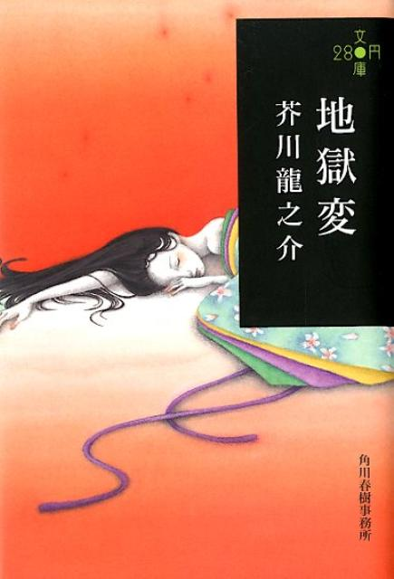

# Hell Screen - Ryūnosuke Akutagawa

9/10

start date: 13 november 2024

finish date: 13 november 2024

this is quite a short story. i think i will revisit it in the future to properly savour the language and take in each perspective but here are my thoughts after the first reading.

the story tells a tragic story of an arrogant painter yoshihide and his beautiful daughter. yoshihide is greatly disliked by the general public and serves a lord in japan. his paintings are "ugly" and he had intentionally carved them to be such grotesque depictions. his daughter is however extremely well liked by the lord and everyone in the mansion as she has a docile and likeable personality and is said to be extremely elegant and attractive. those in the mansion also bought a monkey and named it yoshihide to jest at the father looking like a pissy monkey. yoshihide (monkey) harboured a liking towards the daughter and this parallels her father not only in name but in the care both extend towards the daughter.

the story is told from the eyes of a (potentially high ranking?) officer in the lord's mansion. this persona obviously has a bias towards the lord as the persona always finds a way to excuse and even rhapsodise each deed done by the lord, regardless of whether the deed is of good nature. the lord's ox once killed a commoner and they justified it saying the commoner was extremely grateful or something. also when the persona heard of the rumours of the lord having an affair and potentially lust towards yoshihides daughter, the persona immediately dismissed it and claimed the lord would never do such a thing. even when the persona witnessed (and unwittingly saved) the daughter presumably being assaulted sexually by the lord, the persona did not regard this as a matter of much importance and did not connect the dots of the assaulter to the lord they so revere and cherish. he is so biassed on god

=

> Her eyes were huge and shining. And her cheeks seemed to be burning red. Her disheveled clothes gave her an erotic allure that contrasted sharply with her usual childish innocence. Could this actually be the daughter of Yoshihide? I wondered – that frail-looking girl so modest and self-effacing in all things?

=

also when the lord eventually ordered the daughter to burn along with the carriage the persona did not pick up the signs. lord seemed to be angry at the daughter from his body language and this is corroborated by the rumours that the daughter rejected him in his advances. the persona justified this by saying this was retribution for yoshihide (the painter) for wishing to realise such an evil and vile deed of burning a carriage and a woman alive. 
the story also discusses the love yoshihide has for his daughter despite being a miser and awful person to everyone else. the fatherly love is really respectable and i especially find the part profound -- yoshihide is promised anything that he names be given to him after painting a painting the lord liked. but he only asked for his daughter to be demoted and sent back to him. (also this was rejected and the lord seemed pissed because the lord did not want the daughter taken away from him) -- he was just a father in this sense. an ordinary father who just wanted to reunite with his daughter who is so close to him. in a way the yoshihide monkey acted in his spirit and helped prevent the daughter from getting abused by the lord. see also:

=

> ‘He is just an animal,’ she repeated. ‘He doesn’t know any better.’ And then, smiling sadly, she added, ‘His name is Yoshihide, after all. I can’t just stand by and watch “my father” being punished.’

=

in sum i feel much sorrow for yoshihide as a person. as a person although he is not the most likeable and is quite peculiar to say the least, he gives his everything for the daughter. brings life to his character and shows he is not heartless after all. i feel this witnessing of the daughter going up in flames is hence his personal hell of searing flames and the laughter was his resignation to fate: when the only two things in the mortal world that mattered to him -- his daughter and his paintings -- burned and melded into one.
this struck me deeply. may he rest in peace in the afterlife with his daughter. 9/10
some parts id like to pick out in particular:

---

> I will never forget the look on Yoshihide’s face at that moment. He had started toward the carriage on impulse but halted when the flames flared up. He then stood there with arms outstretched, eyes devouring the smoke and flames that enveloped the carriage. In the firelight that bathed him from head to toe, I could see every feature of his ugly, wrinkled face. His wide-staring eyes, his contorted lips, the twitching flesh of his cheeks: all drew a vivid picture of the shock, the terror, and the sorrow that traversed Yoshihide’s heart by turns. Such anguish, I suspect, would not be seen even on the face of a convicted thief about to have his head cut off or the guiltiest sinner about to face the judgment of the Ten Kings of Hell. Even the powerful samurai went pale at the sight and stole a fearful glance at His Lordship above him.

---

> But oh, how strange it was to see the painter now, standing absolutely rigid before the pillar of fire! Yoshihide – who only a few moments earlier had seemed to be suffering the torments of hell – stood there with his arms locked across his chest as if he had forgotten even the presence of His Lordship, his whole wrinkled face suffused now with an inexpressible radiance – the radiance of religious ecstasy. I could have sworn that the man’s eyes were no longer watching his daughter dying in agony, that instead the gorgeous colors of flames and the sight of a woman suffering in them were giving him joy beyond measure.

---

☆———

---

© 2024 msa - CC BY-NC-SA 4.0

---