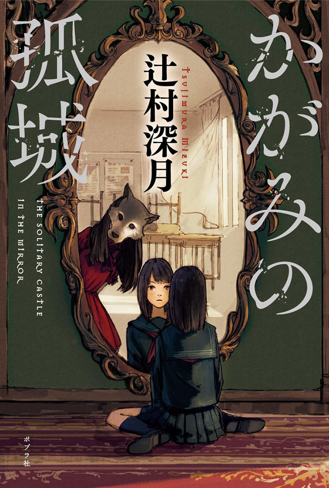

# Lonely Castle in the Mirror - Mizuki Tsujimura

7/10

start date: 26 november 2024

end date: 27 november 2024

--- WARNING ---

to whoever is reading this in the future, my review contains spoilers that basically give all the plot twists away. do NOT read if you intend to read the book for yourself (strongly recommended!)

--- WARNING ---

this novel is written in simpler language than the ones i have previously trudged through, but this did not make the story any less profound or invigorating. if anything, it made it easier to read and truly digest the story of each of the characters and empathise with them. despite starting out with the book with a slight tinge of contempt at the light-novel-esque and whimsical writing style, i was dragged along onto it a third into the book and do not regret one bit that i have read it.

the story is one of many twists and turns. a roller coaster through time, if you will. it all starts with kokoro, our protagonist, a girl beginning the first year of junior high at yukishina no. 5 high school. she is bullied at school for being introverted by the more dominating sanade and co. and kokoros friend moe tojo also seems to distance herself from kokoro. the bullying gets intolerable and kokoro stops going to school because of this.

as she ensconces herself to her bedroom, a mirror brings her and six other total strangers, also kids around her age, into the lonely castle in the mirror, with each of them having their own problems and each not attending ("dropping out of") high school. after days of interaction they soon find out they are from the same high school. one of them called everyone to go to school with them on school opening day but when each of them went there were no others. here i thought it was a schizophrenia thing and kokoro imagined all of them to help her cope but i was wrong.

after everything we find out eventually that:

the wolf queen was not the wolf in little red riding hood, but was rather the wolf in wolf and the seven goats 

the parallel world theory by masamune was wrong and there were no parallel worlds. they were actually living in different times of the same world, with each of the kids being born seven years apart

the wolf queen is actually mio-chan who is rions sister. she passed away due to cancer but before her passing manifested this castle into reality, and dragged all these kids so that they can spend time together or something. god bless them

ms kitajima is actually aki. she married a kitajima dude and now devotes herself into helping kids like these 

the story deals with bullying in japanese schools and the fact that despite there being an abundance of students achieving excellence, the mental wellbeing of students are often neglected in the mini-societies that is school. i hope this has raised attention on this situation in japan and hopefully the rest of the world but that is wishful thinking.. 

thank you yy for inspiring me to read this. the review may seem incomplete but the emotional ride this book took me on is quite a crazy one

---

> And it was true – when she’d entered junior high, she’d suddenly gone from a school with two classes in each year to one with seven, and it had definitely thrown her. She barely knew anyone in her homeroom.

> But that wasn’t it.

> That wasn’t the reason why she had trouble fitting in.

> This woman has no idea what I’ve been through, she thought.

---

> ‘So you didn’t hear anything from Ureshino-kun or Masamune-kun’s families?’

> ‘Hm?’ was all Ms Kitajima said in response. Kokoro shut her eyes tight. It was just like the nurse had said – there was no one by those names in the school. Kokoro couldn’t believe it, but there it was.

> ‘Nothing,’ Kokoro said.

> So it’s true, she thought, as her mind reeled.

> What had it all meant – all these days up till now?

> Was the world of the castle in the mirror not real?

> Now that she thought about it, it seemed like an all-too-convenient miracle.

> How could her bedroom connect up so efficiently with a different world?

> Meeting these kids, thinking they were her friends – wasn’t it all just wish fulfilment?

---

wait but how will they explain kokoros absence from home when mom checked ???

---

^^^mom found out 

---

> ‘I mean, you’re battling every single day, aren’t you?’ she said.

---

in my haste to read i did not put down things i found profound but the story works like that. bit by bit you are dragged into the plot and empathise with the characters. 

---

☆———

---

© 2024 msa - CC BY-NC-SA 4.0

---