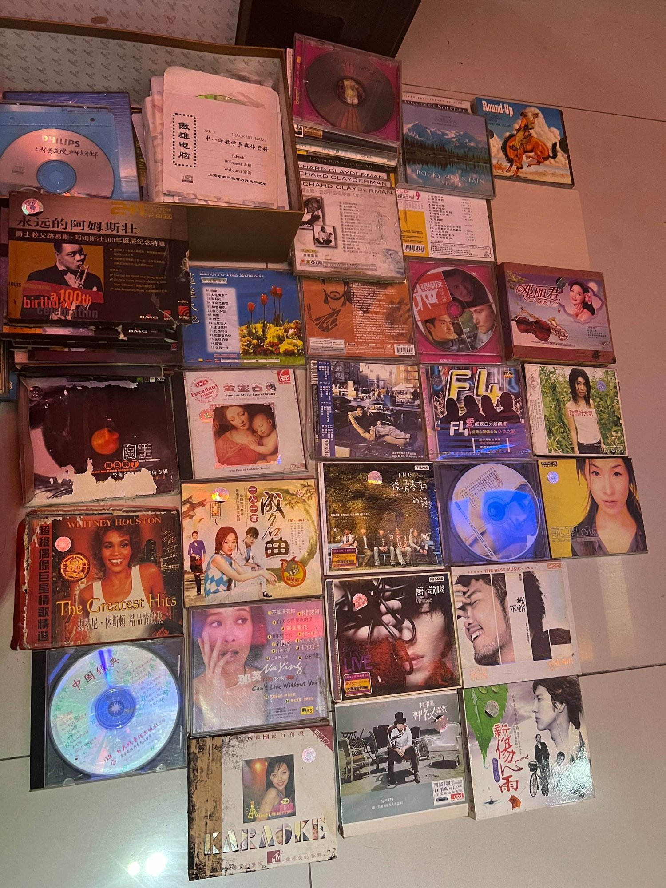
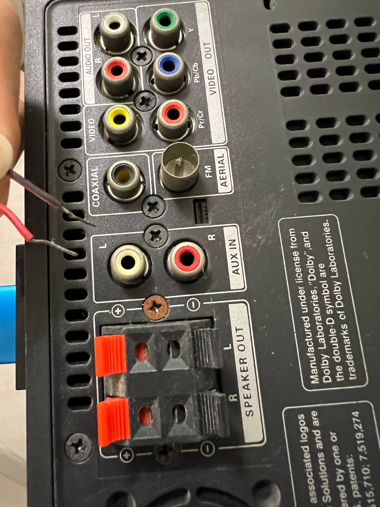

# Salvaging Storage Devices (SSD)

 

## Preface

I returned to my childhood home, and in my quest to get some of my childhood back, I decided to go through everything electronic. Here are some of my finds.

## The Pile

### Pile I: Smart machine & Accessories

#### Laptop

I found this laptop that my grandfather used while he was still working. I believe it was used from around 2010 to 2015. It is in pristine condition and only the laptop charger could not be found, so I simply ordered one online.

The laptop is an HP Pavilion DV3 that runs Windows 7. Everything worked fine so I did not attempt to screw it up via rebirthing it as a Linux machine. I moved on after transferring all noteworthy data out (it contained primarily music).

 

 

 

 

#### USBs

Found USBs! This is where the gamble is at. Will degradation win or will we successfully rescue them!?

Here's the workflow I took:
1. Use ddrescue to create a disk image from the old USB stick.
2. Mount the disk image `sudo losetup -fP ~/recoverdisk/disk.img`.
3. Look around! 
4. If all else fails: `sudo photorec ~/recoverdisk/disk.img`.

Through this way, I rescued quite a few of the old disks and found a mountain of old pictures. Also the kids' shows that I used to watch. 晚安玛卡巴卡~

 

 

 

### Pile II: Cams

Found three cameras:

1. 2003 Sony Cybershot 3.2 Mega Pixels. This beast of a camera uses TWO AAA BATTERIES????? LOL

2. Nikon Coolpix S6100 Digicam. Its battery was terribly bloated so I had to order in a new one + its charger. Works wonders now.

3. DVC Video Camera which also lacks a battery. I did not get one for this one as I intended to bring only the former two back to where I presently stay. It seems to be in perfect working condition though.

 

 

 

 

 

### Pile III: Sound

I found a CD player (which also lacked batteries hence I plugged two AAA batteries in), so naturally I had to dig out the old CDs we had around. I also found cassette tapes but could not find the player, so unfortunately no cassette tinkering.

I also dug out an iPod that my mother used back in her schooling days. I just so happened to have a sound system (also old) with a dock supporting that of the ancient iPhone charging port. Now I have an entire sound system powered by the iPod.

 

 

 

### Pile IV: Miscellaneous

At this point there was not much left to go through. We found old phones and an old pager that my grandmother used. Also ancient guitar strings. 

 

 

## Final Words

Love vintage media. This time the post is less tech-journal and more nostalgia. Now I can film with real 2000s equipment though.

---

© 2025 msa - CC BY-NC-SA 4.0

---